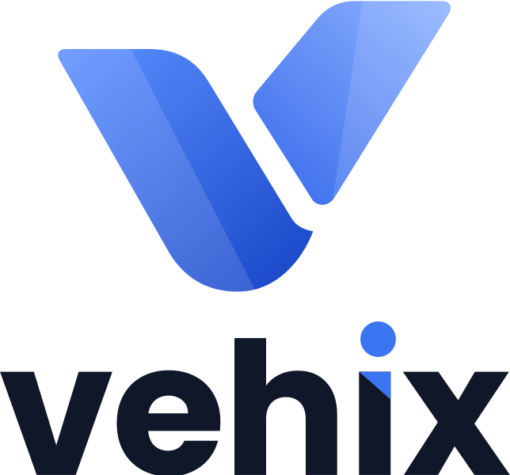
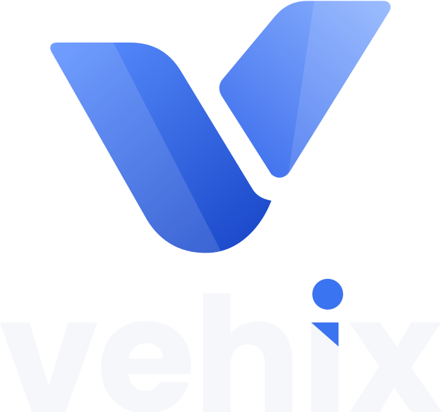
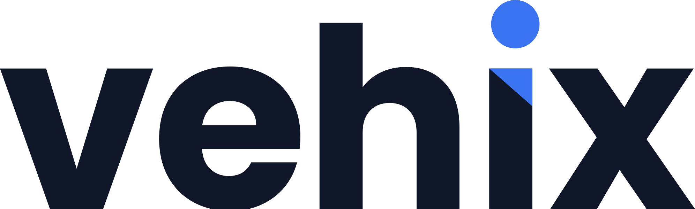
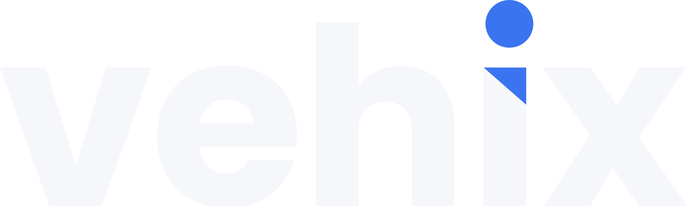
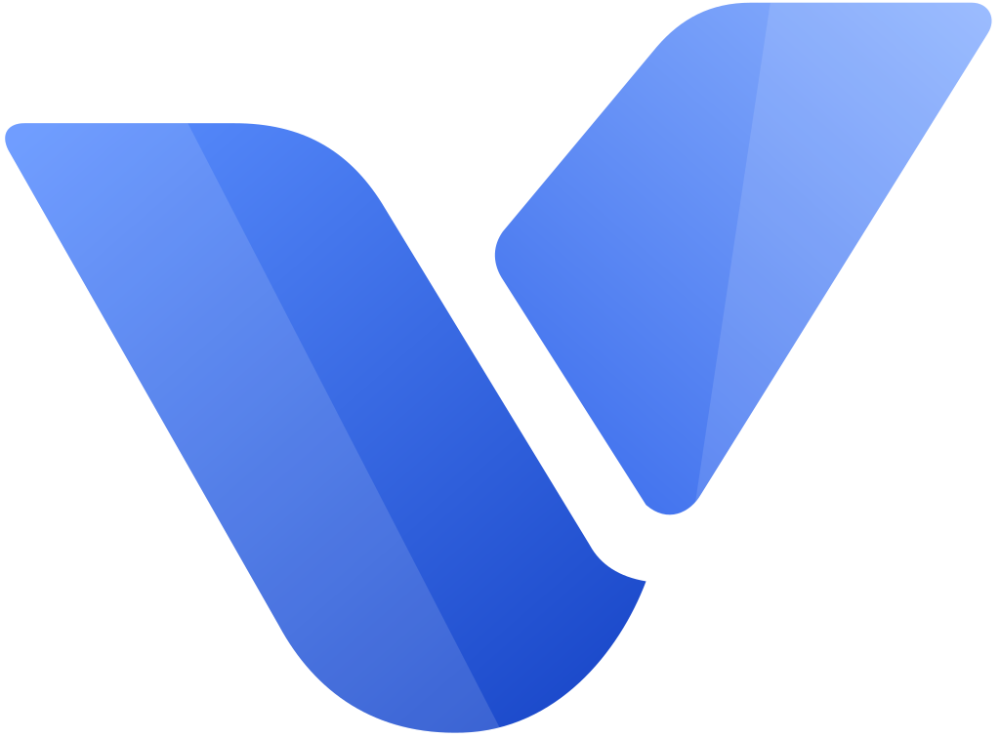
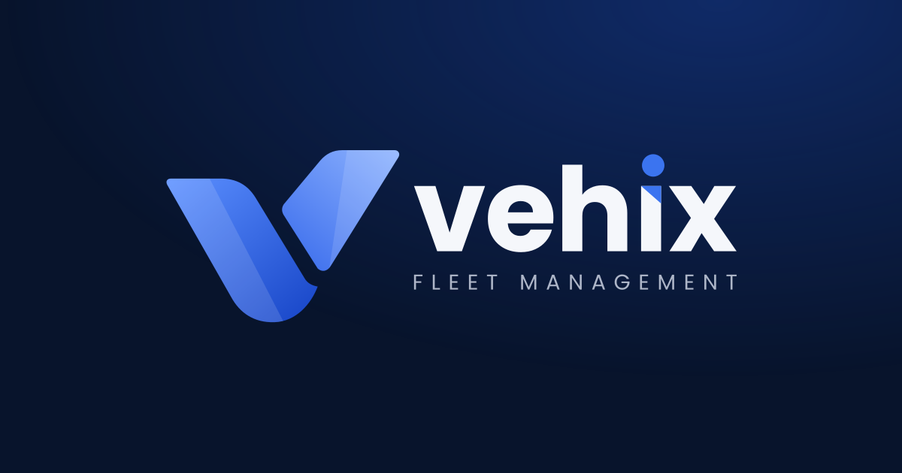

# Vehix brand assets

Every logo variation, generated from one set of vector geometry. **Use the SVGs** wherever possible; they are resolution independent and the lettering is outlined, so no font is needed. PNGs are provided for tools that cannot take SVG.

- Colours: royal blue `#1F55D6` (accent), ink `#0F1729`, navy `#0B1630`. The mark's gradient runs from `#5B8FFF` to `#1846C8` (left blade) and `#8FB4FF` to `#3A6CEC` (right blade).
- Typeface: Poppins Bold (wordmark) and Poppins Regular (tagline), SIL Open Font License (`source/OFL.txt`).
- Clear space: keep at least the height of the wordmark's x-height free around any lockup. Minimum size: mark 16px, horizontal lockup 96px wide.
- Use the `-dark` variants on dark backgrounds (they have light lettering).

## Logos

| Variant | Preview | Files |
|---|---|---|
| Primary (horizontal, tagline) |  | [SVG](svg/vehix-logo-horizontal.svg) · [PNG](png/logo/vehix-logo-horizontal.png) |
| Primary on dark (for dark backgrounds) |  | [SVG](svg/vehix-logo-horizontal-dark.svg) · [PNG](png/logo/vehix-logo-horizontal-dark.png) |
| Horizontal, no tagline |  | [SVG](svg/vehix-logo-horizontal-notagline.svg) · [PNG](png/logo/vehix-logo-horizontal-notagline.png) |
| Horizontal, no tagline, on dark (for dark backgrounds) |  | [SVG](svg/vehix-logo-horizontal-notagline-dark.svg) · [PNG](png/logo/vehix-logo-horizontal-notagline-dark.png) |
| Stacked |  | [SVG](svg/vehix-logo-stacked.svg) · [PNG](png/logo/vehix-logo-stacked.png) |
| Stacked on dark (for dark backgrounds) |  | [SVG](svg/vehix-logo-stacked-dark.svg) · [PNG](png/logo/vehix-logo-stacked-dark.png) |
| Stacked, no tagline |  | [SVG](svg/vehix-logo-stacked-notagline.svg) · [PNG](png/logo/vehix-logo-stacked-notagline.png) |
| Stacked, no tagline, on dark (for dark backgrounds) |  | [SVG](svg/vehix-logo-stacked-notagline-dark.svg) · [PNG](png/logo/vehix-logo-stacked-notagline-dark.png) |
| Monochrome black |  | [SVG](svg/vehix-logo-mono-black.svg) · [PNG](png/logo/vehix-logo-mono-black.png) |
| Monochrome white (for dark backgrounds) |  | [SVG](svg/vehix-logo-mono-white.svg) · [PNG](png/logo/vehix-logo-mono-white.png) |
| Single colour (royal blue) |  | [SVG](svg/vehix-logo-single-color.svg) · [PNG](png/logo/vehix-logo-single-color.png) |
| Wordmark |  | [SVG](svg/vehix-wordmark.svg) · [PNG](png/logo/vehix-wordmark.png) |
| Wordmark on dark (for dark backgrounds) |  | [SVG](svg/vehix-wordmark-light.svg) · [PNG](png/logo/vehix-wordmark-light.png) |
| Mark (icon only) |  | [SVG](svg/vehix-mark.svg) · [PNG](png/logo/vehix-mark.png) |
| Mark, black |  | [SVG](svg/vehix-mark-black.svg) · [PNG](png/logo/vehix-mark-black.png) |
| Mark, white (for dark backgrounds) |  | [SVG](svg/vehix-mark-white.svg) · [PNG](png/logo/vehix-mark-white.png) |

## App icons

Masters are 1024px; 512px and 192px PNGs are alongside.

| Variant | Preview | Files |
|---|---|---|
| App icon, royal blue |  | [SVG](svg/vehix-app-icon-blue.svg) · [1024](png/app-icon/vehix-app-icon-blue-1024.png) · [512](png/app-icon/vehix-app-icon-blue-512.png) · [192](png/app-icon/vehix-app-icon-blue-192.png) |
| App icon, dark |  | [SVG](svg/vehix-app-icon-dark.svg) · [1024](png/app-icon/vehix-app-icon-dark-1024.png) · [512](png/app-icon/vehix-app-icon-dark-512.png) · [192](png/app-icon/vehix-app-icon-dark-192.png) |
| App icon, gradient |  | [SVG](svg/vehix-app-icon-gradient.svg) · [1024](png/app-icon/vehix-app-icon-gradient-1024.png) · [512](png/app-icon/vehix-app-icon-gradient-512.png) · [192](png/app-icon/vehix-app-icon-gradient-192.png) |
| App icon, monochrome |  | [SVG](svg/vehix-app-icon-mono.svg) · [1024](png/app-icon/vehix-app-icon-mono-1024.png) · [512](png/app-icon/vehix-app-icon-mono-512.png) · [192](png/app-icon/vehix-app-icon-mono-192.png) |
| Apple touch icon (full bleed; iOS rounds it) |  | [SVG](svg/vehix-apple-touch-icon.svg) · [1024](png/app-icon/vehix-apple-touch-icon-1024.png) · [512](png/app-icon/vehix-apple-touch-icon-512.png) · [192](png/app-icon/vehix-apple-touch-icon-192.png) |
| Android maskable (safe-zone padding) |  | [SVG](svg/vehix-maskable-icon.svg) · [1024](png/app-icon/vehix-maskable-icon-1024.png) · [512](png/app-icon/vehix-maskable-icon-512.png) · [192](png/app-icon/vehix-maskable-icon-192.png) |

## Favicons

| Size | Preview |
|---|---|
| 16×16 |  |
| 32×32 |  |
| 48×48 |  |
| 64×64 |  |
| 128×128 |  |
| 256×256 |  |

- [`vehix-favicon.ico`](vehix-favicon.ico): 16, 32 and 48px in one file.
- [`svg/vehix-favicon.svg`](svg/vehix-favicon.svg) for large sizes and [`svg/vehix-favicon-small.svg`](svg/vehix-favicon-small.svg) (tighter padding) for 16-48px.

## Social share image



[`png/vehix-og-image.png`](png/vehix-og-image.png), 1200×630.

## Where the app uses them

| File | Source |
|---|---|
| `src/app/favicon.ico` | `svg/vehix-app-icon-dark.svg` at 16, 32 and 48px |
| `src/app/icon.svg` | `svg/vehix-app-icon-dark.svg` |
| `src/app/apple-icon.png` | `svg/vehix-apple-touch-icon.svg` at 180px |
| `src/app/opengraph-image.png` | `png/vehix-og-image.png` |
| `public/icons/icon-192.png`, `icon-512.png` | `svg/vehix-app-icon-blue.svg` |
| `public/icons/maskable-512.png` | `svg/vehix-maskable-icon.svg` |
| Sidebar and sign-in logo | `src/components/brand-logo.tsx` (inline SVG, follows the theme) |

## Regenerating

Everything here comes from `source/generate.py` (geometry, colours, lockups) and `source/export.mjs` (PNG, ICO and the app copies). From the repo root:

```bash
python3 -m venv /tmp/vehix-brand && /tmp/vehix-brand/bin/pip install fonttools
/tmp/vehix-brand/bin/python brand/source/generate.py brand/svg
node brand/source/export.mjs
```

If you change the mark or wordmark geometry, update `src/components/brand-logo.tsx` from `source/geometry.json` as well.
